=== TÊN (VI) ===
HTMS — Đặt phòng khách sạn trực tuyến

=== TÊN (EN) ===
HTMS — Online Hotel Booking Storefront

=== TÓM TẮT (VI) ===
HTMS là giao diện đặt phòng trực tuyến giúp khách sạn vừa và nhỏ giới thiệu hạng phòng, dịch vụ kèm theo và nhận yêu cầu lưu trú ngay trên website. Khách xem danh sách phòng với giá theo đêm, lọc theo hạng và khoảng giá, mở chi tiết kèm ảnh rồi gửi đơn đặt phòng sau khi đăng nhập. Trang chủ có thanh tìm nhanh theo ngày nhận–trả và hạng phòng. Khách theo dõi lịch sử đặt phòng, đăng ký trải nghiệm dịch vụ (spa, buffet, đưa đón…) và gửi liên hệ kèm câu hỏi thường gặp. Hệ thống hướng tới trải nghiệm đặt phòng rõ ràng, giảm trao đổi thủ công qua điện thoại và hỗ trợ đội ngũ chăm sóc khách hàng xử lý yêu cầu tập trung hơn.

=== TÓM TẮT (EN) ===
HTMS is an online booking storefront that helps small and mid-size hotels present room categories, add-on services, and receive stay requests directly on the website. Guests browse nightly rates, filter by room type and price range, open photo-rich details, then submit a booking after signing in. The homepage includes a quick search bar for stay dates and room grade. Guests can review booking history, request experiences such as spa, buffet, or airport transfer, and send contact messages with FAQ answers nearby. The product focuses on a clear booking journey, fewer phone-only exchanges, and a more organized handoff for guest-care teams.

=== MÔ TẢ MARKDOWN (VI) ===
```markdown
## Tổng quan

HTMS (Hotel Management System) mang đến kênh đặt phòng trực tuyến dành cho khách sạn muốn số hóa bước tìm phòng và gửi yêu cầu lưu trú. Khách truy cập website, xem bộ sưu tập phòng và suite, so sánh hạng Standard / Deluxe / Suite cùng giá niêm yết theo đêm, rồi mở form đặt phòng với ngày nhận–trả, hình thức thuê và ước tính tổng tiền (gồm phần phụ phí hiển thị trên form).

Giao diện công khai tập trung vào hành trình khách: trang chủ giới thiệu thương hiệu và các khối phòng nổi bật, danh sách phòng có bộ lọc, trang chi tiết phòng với thư viện ảnh và tiện nghi, trang dịch vụ kèm form đăng ký trải nghiệm, trang liên hệ với thông tin hotline/email và câu hỏi thường gặp, cùng trang lịch sử đặt phòng dành cho tài khoản đã đăng nhập.

## Điểm nổi bật

- **Tìm phòng nhanh trên trang chủ**: chọn ngày nhận–trả, hạng phòng và số khách rồi chuyển sang danh sách phù hợp.
- **Danh sách phòng có lọc**: tìm theo tên/số phòng, lọc hạng, kéo khoảng giá, đổi chế độ xem lưới hoặc danh sách.
- **Chi tiết phòng rõ ràng**: ảnh lớn, mô tả, tiện nghi, chính sách nhận–trả và nút đặt phòng nổi bật.
- **Đặt phòng có tổng tiền dự kiến**: form tính số đêm, thuế/phí dịch vụ và xác nhận sau khi đăng nhập.
- **Dịch vụ kèm theo**: buffet, spa, đưa đón, giặt ủi… với form ghi nhận yêu cầu ngày giờ.
- **Tài khoản khách**: đăng nhập / đăng ký, xem lịch sử đơn và trạng thái (xác nhận, hoàn tất, hủy…).
- **Liên hệ & hỗ trợ**: form gửi yêu cầu, thông tin liên lạc và FAQ về check-in, hủy phòng, đưa đón.

## Công nghệ

Frontend React (Vite) với giao diện thành phần hiện đại; backend Java Spring Boot và cơ sở dữ liệu MySQL phục vụ API phòng, đặt phòng, người dùng và phản hồi. Có chế độ dữ liệu demo để chạy giao diện ổn định khi trình diễn.

## Đối tượng phù hợp

Khách sạn / resort quy mô vừa và nhỏ cần website đặt phòng công khai; đội vận hành muốn nhận yêu cầu lưu trú và dịch vụ qua một kênh thống nhất; đối tác triển khai muốn demo nhanh hành trình khách từ tìm phòng đến xác nhận đơn.
```

=== MÔ TẢ MARKDOWN (EN) ===
```markdown
## Overview

HTMS (Hotel Management System) provides an online booking channel for hotels that want to digitize room discovery and stay requests. Guests open the website, browse rooms and suites, compare Standard / Deluxe / Suite grades with nightly list prices, then submit a booking form with check-in/out dates, stay type, and an on-form estimate of total cost (including the displayed service charge portion).

The public experience follows the guest journey: a branded homepage with featured rooms, a filterable room catalog, room detail pages with galleries and amenities, a services page with request forms, a contact page with hotline/email and FAQs, plus a booking-history page for signed-in accounts.

## Highlights

- **Quick search on the homepage**: pick stay dates, room grade, and guest count, then jump to matching listings.
- **Filterable room catalog**: search by name/number, filter by grade, adjust price range, switch grid or list view.
- **Clear room details**: large photos, description, amenities, check-in/out policy, and a prominent book action.
- **Booking with estimated total**: the form shows nights, tax/service fee, and confirms after login.
- **Add-on services**: buffet, spa, transfers, laundry, and more via date/time request forms.
- **Guest accounts**: sign in / register, review booking history and statuses (confirmed, completed, cancelled…).
- **Contact & support**: message form, contact details, and FAQs on check-in, cancellation, and transfers.

## Technology

React (Vite) frontend with a modern component UI; Java Spring Boot backend and MySQL for rooms, bookings, users, and feedback APIs. A demo data mode supports stable storefront demos without a live backend.

## Who it fits

Boutique hotels and resorts that need a public booking website; operations teams that want stay and service requests in one channel; implementation partners who need a fast demo of the guest path from room search to confirmed booking.
```

=== TÍNH NĂNG CÓ SẴN (VI) ===
Tra cứu phòng và giá đêm
Lọc hạng phòng khoảng giá
Đặt phòng trực tuyến có tổng tiền
Xem chi tiết phòng kèm ảnh
Đăng ký dịch vụ kèm theo
Theo dõi lịch sử đặt phòng
Đăng nhập đăng ký tài khoản
Liên hệ hỗ trợ và FAQ

=== TÍNH NĂNG CÓ SẴN (EN) ===
Browse rooms and nightly rates
Filter by type and price
Online booking with total estimate
View room details with photos
Request add-on hotel services
Track personal booking history
Sign in and create account
Contact support with FAQ

=== ẢNH MARKETING ===
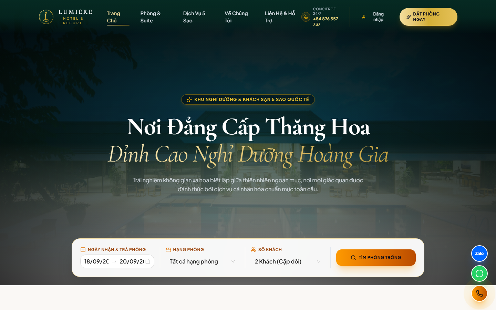

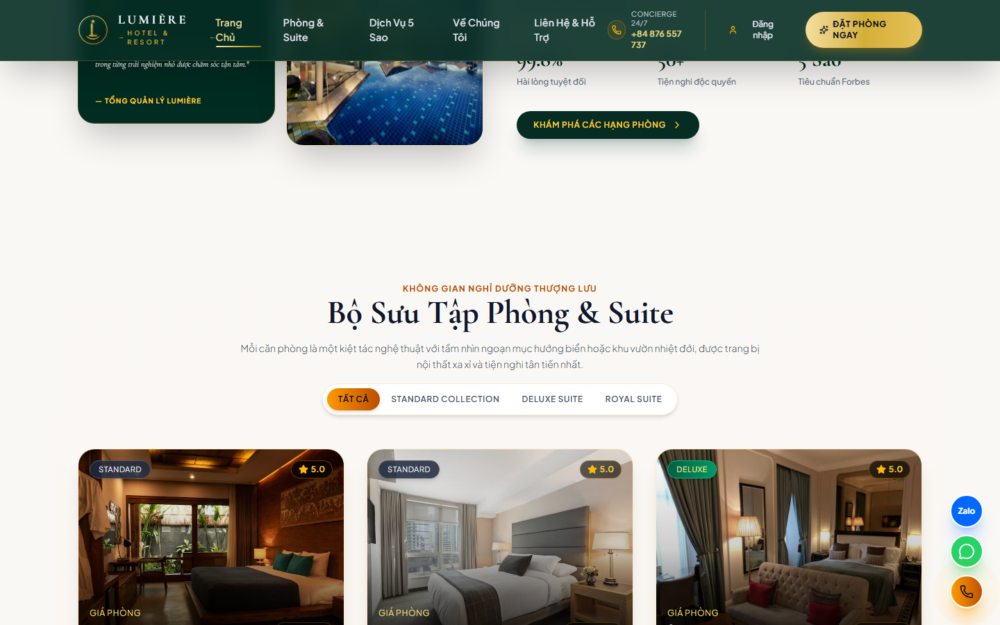
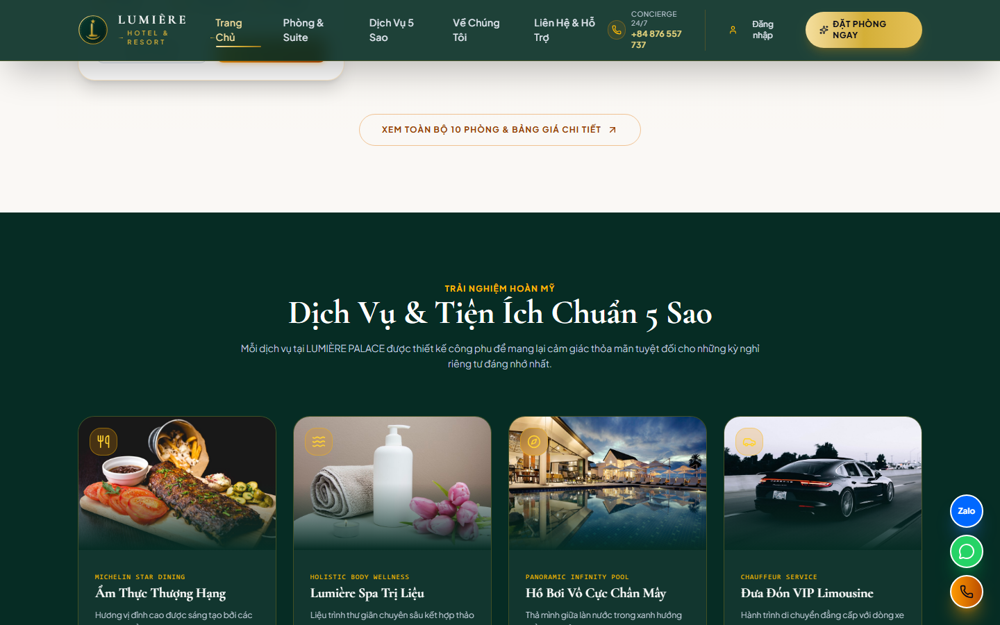
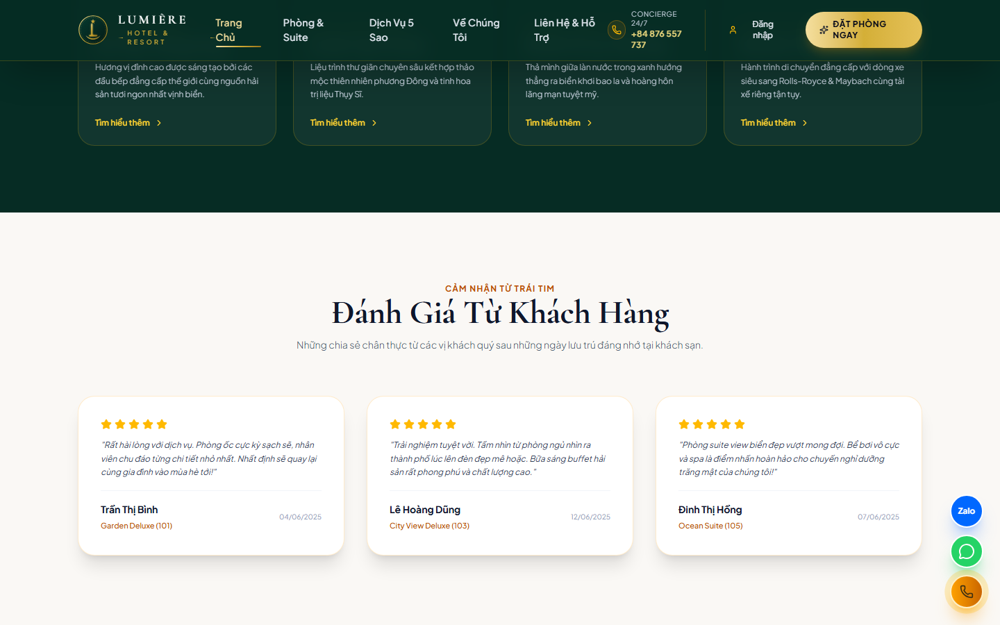
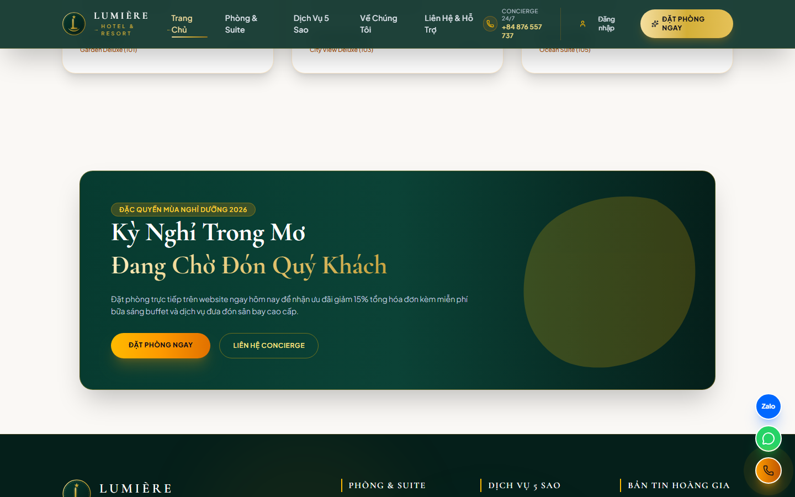
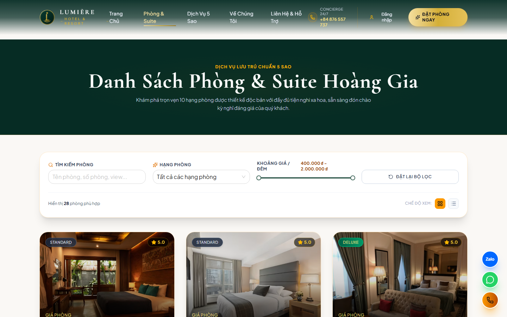
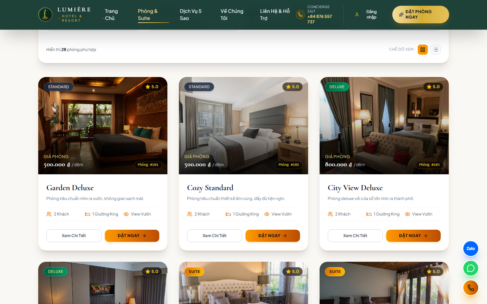
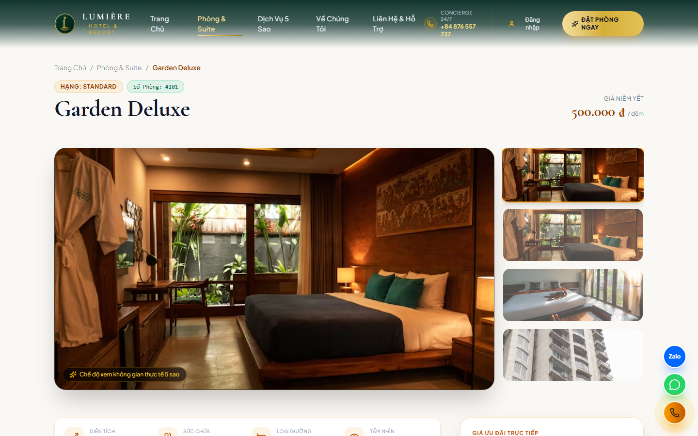
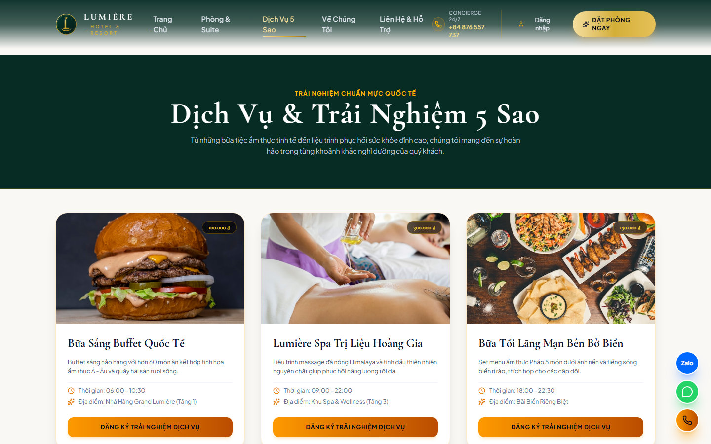
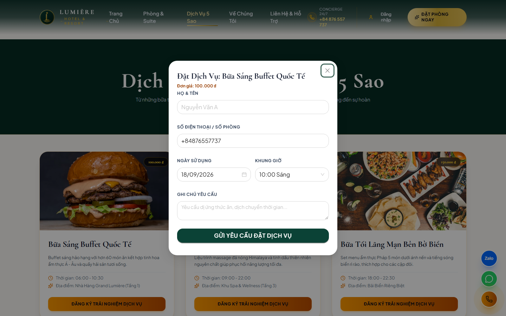
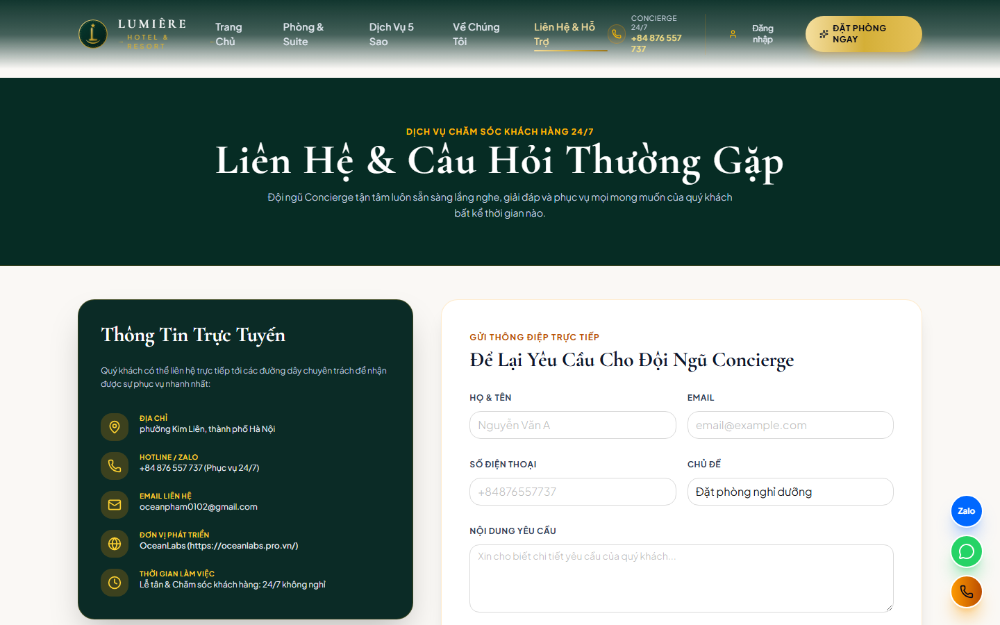
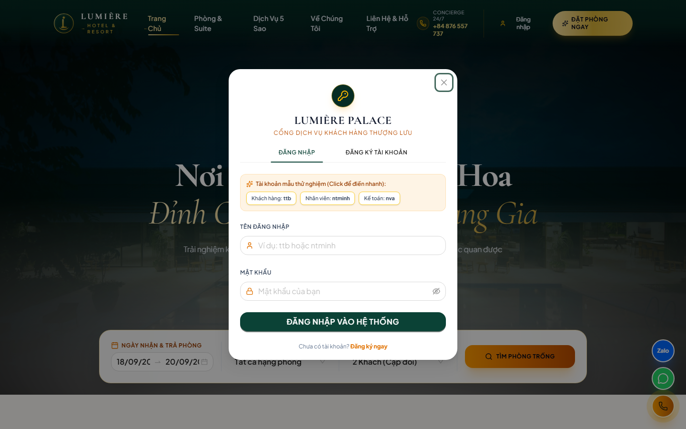
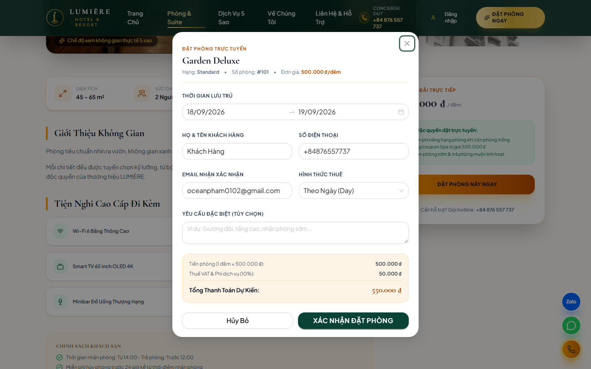
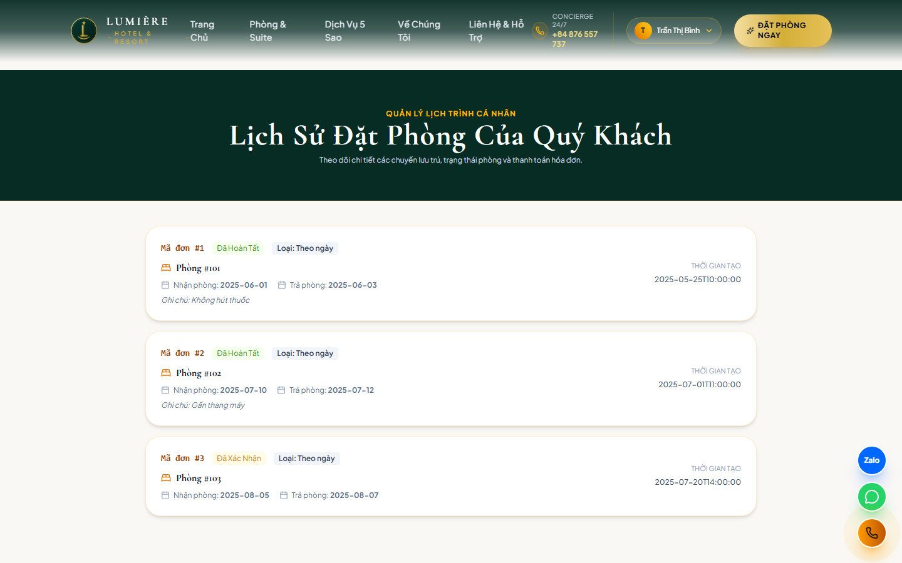
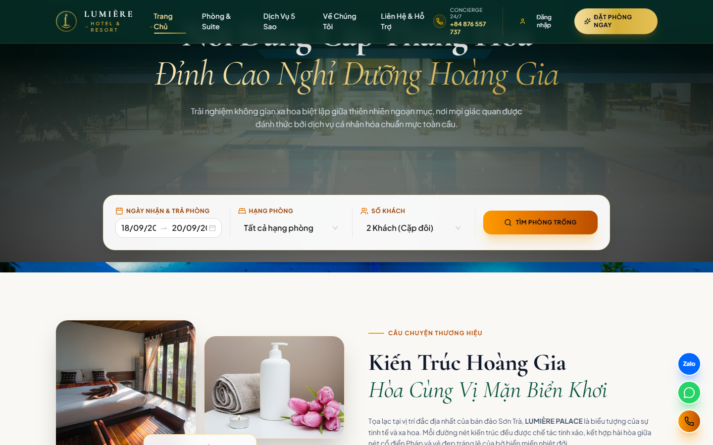
